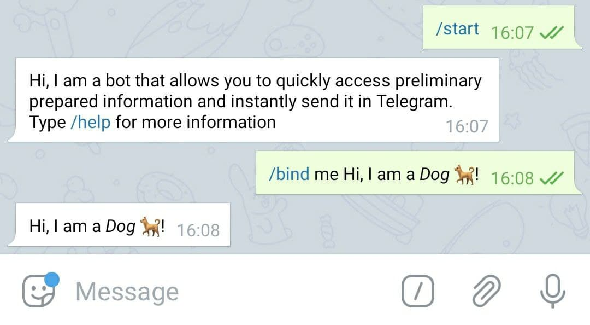
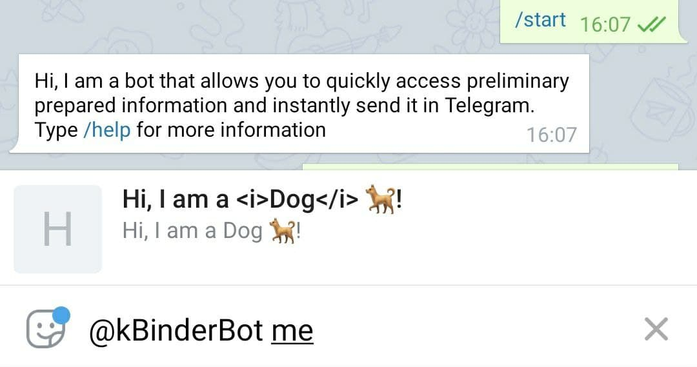
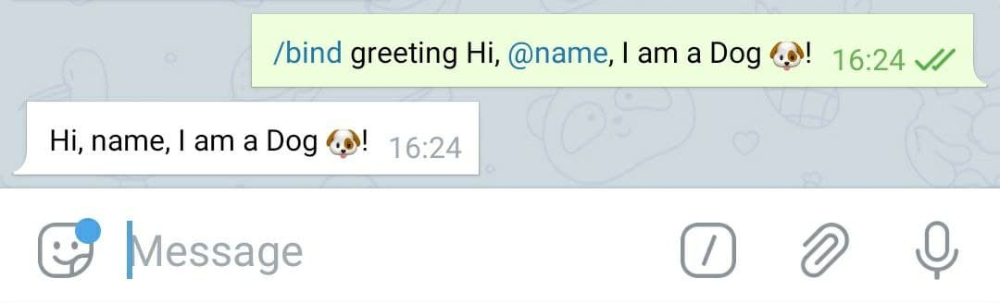

# kBinderBot
Keyword Binder Bot for telegram

#### Download project
```cmd
git clone https://github.com/HewstonFox/kBinderBot
cd kBinderBot
```

#### Requirements
```
pip install requirements.txt
```

#### Run the bot
```
python main.py
```
#### Environment
You should define environment variables: \
`BOT_TOKEN` - Token to bot  
`MONGODB_URL` - MongoDB connection string 

## How to use

#### 1. Go to private chat with bot
#### 2. Send `/bind <keyword> any content`



#### 3. Type `@<BotNickname> <keyword>` and select an option in shown list



## Special abilities
#### Variables


To create changeable content in your template use `@default_value` (without spaces)
To set it while using enter new values after keyword in order defined in template



>`@` without default value will be removed if no value presented while using  

>To save a link to user like `@NickName` type `\ ` before it like: `\@NickName`, slash will be deleted.  

#### Formatting


You can use all telegram formatting abilities in your template, just format message
via telegram built-in methods


#### File group


You can send several files in one message (photo, video, documents, audio, GIF) 
to have ability to choose it while using like option in shown list


